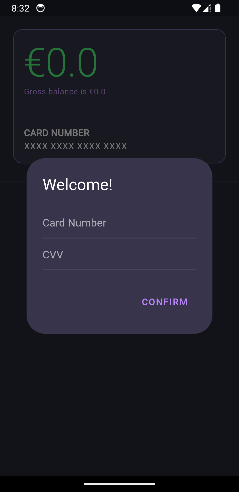

# Santander Meal :apple:

A simple app, written in [Flutter](https://flutter.dev/), that allows you to manage your prepaid Santander Meal card.

Latest release available [here](https://github.com/TheForgottened/santander-meal/releases/latest).

## Table of Contents

- [Table of Contents](#table-of-contents)
- [Screenshots](#screenshots)
- [What It Does](#what-it-does)
- [How To Use](#how-to-use)
- [How to Build](#how-to-build)
- [Honorable Mentions](#honorable-mentions)

## Screenshots

    
    &nbsp; &nbsp; &nbsp; &nbsp;
    

## What It Does

For now, the only thing you can do is check your balance.

## How To Use

The first time you open the app, you'll be prompted to insert your card details. Shortly after you press confirm the information on the screen should change from the default ones to the real ones (if you have no balance one good way to check is if the last 4 digits of the card number are visible).

If for some reason you mistyped your card information, the only way to reset it is to clean the app's data.

## How to Build

There's makefile commands to build for the intended plataforms. If you wish to build to another platform, just make sure you run `make pre-build` first.

## Honorable Mentions

[Rui Dias](https://github.com/netsoft-ruidias) for [this](https://github.com/netsoft-ruidias/ha-custom-component-santanderrefeicao) example of how to use the Santander ""API"".

[Zeno Rocha](https://github.com/zenorocha) for his amazing work on the most famous dark theme ever created, [Dracula Theme](https://draculatheme.com/), which inspired the color scheme of the application.
